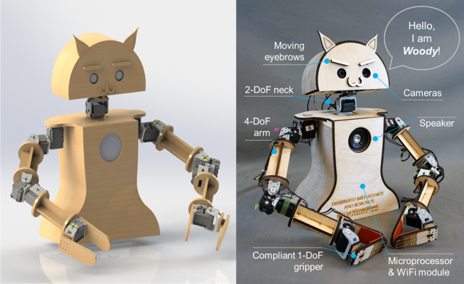
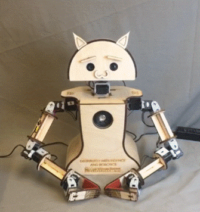
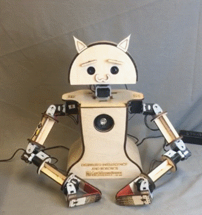
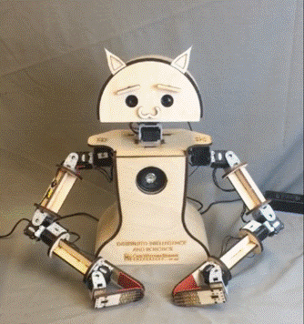

# Woody
This is the software package with the manual book associated with the paper: "Woody: Low-Cost, Open-Source Humanoid Torso Robot"

## Introduction

* This paper presents a humanoid torso robot,
named Woody. It has two arms, each with five degrees of
freedom (DoF) and a 2-DoF neck supporting the head with
two moving eyebrows. Woody’s hardware is made primarily
from laser-cut plywood. Two cameras, a microphone, a speaker,
and a microprocessor board are embedded in the robot.
The processor board also contains a wireless communication
module for remote control and access to networked or cloudbased
resources. The interactive functions include face tracking,
facial emotion recognition, and several pre-programmed default
gestures. Woody’s graphical user interface (GUI) provides its
users with instructions on hardware construction and initial
setup. Through this GUI, the user can also program the robot
and record new gestures by its motion recording function.
Woody is developed as an open-source hardware platform that
can also utilize open-source software for educational purposes.
<p align="center">

</p>

## Set up Woody
*  Hardware assembly book (.pdf) https://github.com/liuxiao1468/Woody/tree/master/manual%20book
*  Software set up files (the rest) https://github.com/liuxiao1468/Woody/tree/master/software%20package

## Functionality

* Build-in gestures: Woody features several built-in gesture functions. Users can record new gestures and motions using the embedded motion recording function.
* Moving eyebrows: Woody’s eyebrows can be programmed to have a specific angles or dynamically move to show different emotion expression.
* Build-in facial emotion recognition : The “Interact with Woody” function will open a window displaying the real-time camera view running face detection and Facial Emotion recognition (FER) algorithms.

<p align="center">

</p>

## Citation
* Please cite the paper if you used any materials from this repo, Thanks.
```
@inproceedings{hayosh2020woody,
  title={Woody: Low-Cost, Open-Source Humanoid Torso Robot},
  author={Hayosh, Daniel and Liu, Xiao and Lee, Kiju},
  booktitle={2020 17th International Conference on Ubiquitous Robots (UR)},
  pages={247--252},
  year={2020},
  organization={IEEE}
}
```

